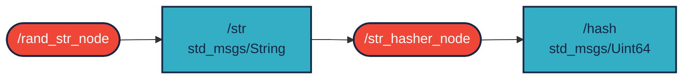
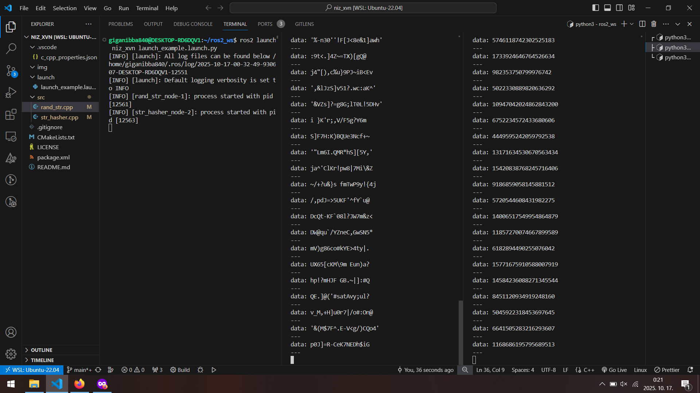

# `niz_xvn` package

ROS 2 C++ package. [](https://docs.ros.org/en/humble/)

The package consists of 2 nodes.
/rand_str_node generates a random ascii string without duplicate characters that is published in a single std_msgs/String topic.
/str_hasher hashes the collected topic and publishes it in a single std_msgs/uint64 topic.

## Packages and build

It is assumed that the workspace is `~/ros2_ws/`.

### Clone the packages

```r
cd ~/ros2_ws/src
```

```r
git clone https://github.com/nkaroly03/niz_xvn
```

### Build ROS 2 packages

```r
cd ~/ros2_ws
```

```r
colcon build --packages-select niz_xvn --symlink-install
```

<details>
<summary> Don't forget to source before ROS commands.</summary>

```bash
source ~/ros2_ws/install/setup.bash
```

</details>

```r
ros2 launch niz_xvn launch_example1.launch.py
```

## Graph




